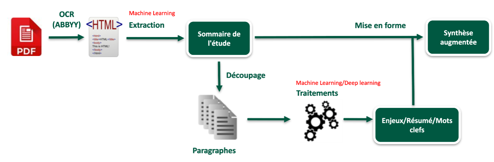

# Projet de TLN français de l'Ecolab : sommaires détaillés, résumé automatique, similarité de documents (19/05/2021)

Bienvenue dans le référentiel consacré au projet de l'Ecolab sur le Traitement du Langage Naturel (français).

Vous pourrez trouver ici les codes finis et les codes exploratoires produits par l'équipe en charge du projet. Tout le projet est écrit en Python (ou Jupyter).

## Objectif : produire des outils, via du Machine Learning et du Natural Language Processing, pour aider les auditeurs qui élaborent les avis sur les études d'impact environnemental.

Les auditeurs de la DREAL, Bretagne en l'occurrence, doivent analyser et rendre un avis environnemental sur des études d'impacts. Ces études sont parfois très longues (en moyenne 300 pages, avec un écart-type de 400, certaines études font plus de 1000 pages) et contiennent de nombreuses annexes (plans, photos etc...).  
L'objectif de ce projet est de produire un outil, la __synthèse augmentée__, permettant d'avoir accès à un document court présentant les informations importantes de chaque paragraphe d'un document long et dense en information. Cette synthèse permet donc de jeter un coup d'oeil transversal rapide sur l'ensemble de l'étude, mais aussi d'y revenir lors du temps de l'analyse, de pouvoir comparer plus aisément au sein du même document mais aussi entre documents.  

Ce document synthétique se présente sous la forme d'un sommaire, où pour chaque titre est associé trois éléments : les enjeux importants, un résumé ainsi que des mots clés. Ce sommaire sera à terme navigable.

L'ensemble des travaux développés sont ré-utilisables et applicables à tout type de document, modulo un ré-entraînement potentiel pour une meilleure adéquation avec le corpus considéré. C'est d'ailleurs dans cet esprit que nous avons travaillé sur ce projet : permettre une bonne généralisation.

Notre point de départ est donc l'ensemble des études d'impacts de la DREAL Bretagne, qui suivent un processus en plusieurs étapes :

1. [la détection et l'extraction des sommaire de documents PDF, puis le découpage des sections](#sommaire) ;
2. [le traitement et l'analyse des enjeux (via du **topic modelling**)](#enjeux);
3. [le résumé automatique de sections (via du **Deep Learning**, plus moins *supervisé*)](#resume).
4. [l'extraction de mots-clés (via du **Deep Learning**,**Graphs** et approches **Statistiques** *non supervisées*)](#motscles)

Enfin, une autre fonctionnalité développée est :

5. [un système de recommandation d'avis (fondé sur du **Deep Learning** et du **Collaborative Filtering** notamment )](#recommandation)

De manière visuelle, le pipeline du projet de __synthèse augmentée__ se présente comme suit :

  

Pour le moment, il existe quatres dossiers :
* **Pipeline** : qui correspond aux chemins d'exécutions des travaux ayant été exécutés sur Dataiku. Notamment, l'analyse des enjeux, la détection et l'extraction des sommaires, le découpage des documents; la détection des avis vides.
* **Ruben** : tous les codes _exploratoires_ de Ruben Partouche (@rbpart).
* **Theo** : tous les codes _exploratoires_ de Théo Roudil-Valentin (@TheoRoudilValentin).
* **Zakaria** : tous les codes ainsi que la documentation liés à l'extraction de mots-clés et à la recommandation d'avis (@IIZCODEII).

Ces codes exploratoires sont parfois flous pour des personnes extérieures au projet, mais cela est normal. Les codes finaux seront mis dans **Pipeline** et expliqués par des documents et par des précisions dans le code lui-même. Les codes exploratoires sont laissés à but informatif.

Pour setup le projet, il faut exécuter le script setup.py depuis la racine du projet (2021-NLP_AE) qui va aussi chercher les dernières données (environ 10Go) sur le disque partagé du SRI (le renommer en K si ce n'est pas le cas pour votre ordinateur). Attention : pour le moment le setup va juste identifier les noms de fichier sans comparer le contenu : il faut supprimer les fichier puis relancer setup si on veux actualiser un fichier (amélioration a faire).

## 1 - Détection et extraction du sommaire
Avant toute chose, nous avons transformés en HTML les études d'impact dont nous dispositions, à savoir les dossiers clos disponibles sur https://www.projets-environnement.gouv.fr/pages/home/ (soit environ 650 études). Pour cela, nous avons utilisé le logiciel propriétaire ABBYY Fine Reader. Sur ces 650 études, seules 150 ont été utilisables après le traitement ABBYY, cette réduction est dûe à plusieurs erreurs : mot de passe, PDF trop lourd etc...
### 1.1 - Construction de la base HTML
Une fois cette OCRisation (ROC, Reconnaissance Optique de Caractères, ici transformation de PDF en texte) faîte, nous avons utilisé le premier code disponible dans **Pipeline** pour découper chaque fichier disponible, ligne par ligne. Ainsi, nous avons une base de données où pour chaque numéro d'études, nous avions un ensemble de lignes correspondants à celles disponibles dans le fichier HTML : numéro x lignes. Ces lignes comportent donc toute l'information du fichier HTML. Au final, la dimension de la base était d'environ 2M de lignes x une quarantaine de colonnes.

Notre hypothèse était que, si l'OCR était correcte, les titres devraient avoir une distribution de balises HTML différente des lignes normales. Ainsi, il devrait être possible de les détecter.
### 1.2 - Création des variables (feature engineering)
Dans un second temps, nous avons donc dû créer des variables permettant d'avoir une représentation de ces distributions. Pour cela, nous avons créé un ensemble de variables dont beaucoup de binaires pour capter l'information disponible dans les lignes.
Pour chaque balise présente dans l'ensemble des fichiers HTML fut donc codé une variable binaire pour indiquer la présence de la balise dans la ligne considérée. D'autres variables renseignent sur la longueur de la ligne, le nombre de mots, le nombre de caractères, la présence de caractères spéciaux ou encore la taille de la police d'écriture. De même, une variable importante a été le repérage des lignes proches du mot **sommaire** et avant la première répétition de la première ligne correspondante. Concrètement, lorsqu'apparait le mot "sommaire" (ou "Table des matières" etc...) il est très probable que les lignes suivantes soient des titres, et que ce sommaire s'arrête à la première apparition de la première ligne après le mot "sommaire" (autrement dit, l'apparition du premier titre). Cependant cette variable a posé beaucoup de problèmes car nous avons remarqué que notre processus n'arrivait pas à coder correctement toutes les études. En effet, ces études sont très différentes et font preuve d'un spectre de structure très large, rendant donc la création de variables particulièrement difficile.
### 1.3 - Les étapes de la détection
Avant de passer directement à la détection, nous avons tenté de faciliter l'apprentissage des futurs modèles. Notamment, nous avons remarqué que beaucoup de variables binaires semblaient apporter la même information. Nous avons donc mis en place une ACP pour réduire la dimension de notre base. Pour les 33 variables binaires dont nous suspections une rendondance d'information, nous avons encodé 12 variables via l'ACP avec un score d'explication de variance très élevé (proche de 98%).

Notre but final étant d'avoir un classifieur permettant de détecter parfaitement les titres, nous avons procédé par étapes.
D'abord, comme nous travaillions en aveugle, nous n'avions pas d'informations sur les lignes et donc ne savions pas lesquelles étaient des titres ou non, nous avons appliqué un algorithme de K-means (K=2) pour séparer une première fois les lignes, toujours en se basant sur l'hypothèse initiale. Ainsi nous obtenions deux groupes, dont un comportant une grande majorité de ce que nous considérions, à l'oeil humain, comme des titres. L'autre étant constitué de beaucoup de lignes de textes. Cette première classification nous a donc permis d'obtenir une premire __idée__ de la __vraie valeur__ des lignes.
Puis, nous avons sélectionné un sous-ensemble de 300000 lignes dont nous avons relabellisé les déchets du __groupe des titres__. Ce choix de ne considérer qu'un groupe repose sur le fait que le groupe des titres du K-means était beaucoup plus réduit et semblait contenir beaucoup plus d'erreurs relativement à sa taille. Une piste d'amélioration serait de relabelliser l'ensemble, mais cela demande beaucoup de temps et constitue un travail peu gratifiant. Une fois ce sous-ensemble relabellisé, nous étions donc en possession d'un nouveau label, un raffinement de la prédiction du K-means. C'est ce label qui nous a servi pour entraîner un modèle de __machine learning__ supervisé.
A partir de là, nous avons entraîné un modèle de Forêt Aléatoire pour retrouver le label raffiné, en prenant l'ensemble des variables créées via le HTML ainsi que le label fourni par le K-means. Ce modèle réussissait quasiment parfaitement à retrouver le label que nous lui fournissions (score proche voir égal à 1). Cependant, après vérification, bien que le score soit de 1, les titres fournis furent décevants : sommaires incomplets, déchets dans le sommaire voir absence de sommaire.
Nous avons donc rajouté une étape de relabellisation de ce dernier label fourni par le modèle de Forêt Aléatoire et de même retravaillé la partie de création de variables.
Au final, après plusieurs itérations, les résultats furent nettement améliorés bien qu'imparfaits. Pour une majorité d'études, nous étions capables de sortir le sommaire complet. Cependant, nous ne pouvons fournir de score rigoureux car cela nécessiterait une labellisation humaine.
### 1.4 - Extraction et découpage
Une fois les titres labellisés, il a suffi de les sortir et d'essayer de les retrouver dans le texte HTML que nous avions à l'origine. Cette étape s'est révélé anormalement complexe et peu concluante. Un processus standard de découpage du texte entre deux titres pour chercher les paragraphes correspondant a très peu fonctionné et a semblé incapable de nous fournir, pour chaque titre, les paragraphes associés.

Face à cette difficulté,

## 2 - Traitement et analyse des enjeux
**Objectif** : identifier les enjeux présent dans un texte de longueur variable (idéalement le plus court possible)

Vous trouverez l'ensemble des travaux opérationnels dans Pipeline/Enjeux
Quelques travaux exploratoires et exemples d'utilisation sur les avis et les sections peuvent être trouvés dans le répertoire Ruben, voir les codes "Avis_semisupervised.py" et "Section_semisupervised.py" qui servent d'exemple d'utilisation du pipe.
Un README y est également présent pour expliquer les développements et explorations faites sur cette partie du projet.

## 3 - Résumé automatique de sections
**Objectif** : effectuer du résumé extractif (sélection des phrases pertinentes) sur les sections des études d'impacts.

Vous trouverez l'ensemble des travaux opérationnels et exploratoires dans le dossier [Théo](https://github.com/ecolabdata/2021-NLP_AE/tree/master/Theo).
 
Nous développons quatre approches différentes qui sont :
* Une famille de modèles basées sur du __Deep Learning__
* Un modèle utilisant l'algorithme TextRank
* Un modèle basé sur la similarité de l'embedding des phrases
* Enfin une famille de modèle __benchmark__ pour la comparaison

Veuillez vous référer au dossier Théo pour y lire la note technique, ainsi qu'une explication plus précise et formelle dans le README disponible.

## 4 - Extraction de mots-clés

**Objectifs** :
* Extraire des mots-clés pertinents sur les sections des études d'impacts (et tout autres documents) en l'absence de données labellisées et de recul sur le meilleur modèle pour un cas d'usage donné.
* Proposer un package directement actionnable pour toutes personnes/organisations voulant extraire des mots-clés sur un corpus de texte sans expertise prélable ni a priori sur les performances des nombreux modèles disponibles.

Pour une présentation détaillée du modèle *keyBoost* qui en découle , se référer au dossier *Zakaria*. Une documentation complète est disponible dans le sous-répertoire *Docs* de *Zakaria*. Cette document retrace le contexte, l'architecture technique, la validation scientifique de la pertience de *keyBoost*, un demonstrateur web interactif ainsi qu'un tutoriel/documentation sur le package python *keyBoost*.

## 4 - Système de recommandation d'avis
**Objectif** : formuler des recommandations d'avis correspondant à des études d'impacts similaires.

# **Contacts et citations :**
Ruben Partouche : ruben.partouche@student-cs.fr  
Théo Roudil-Valentin : theo.roudil-valentin@ensae.fr  
Zakaria Bekkar : zakaria.bekkar@ens-paris-saclay.fr  

