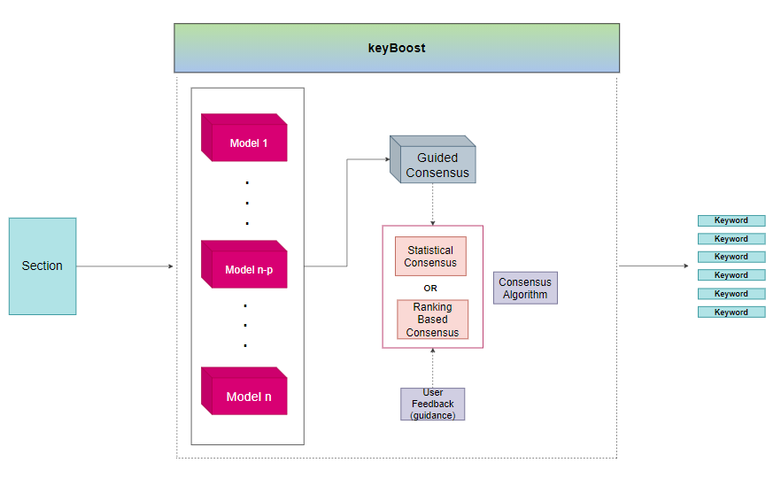

[](https://zenodo.org/badge/latestdoi/389295849)
[](https://colab.research.google.com/drive/19oAPrqmfeO_1F_losdF8hvuN5iq-HtVa?usp=sharing)

<p align = 'center'>  </p>

# KeyBoost

KeyBoost est un outil d'extraction de mots clés simple et facile à utiliser qui vous évite d'avoir à sélectionner les meilleurs modèles pour votre cas d'utilisation spécifique. Aucune connaissance de la littérature sur l'extraction de mots-clés ou d'expertise n'est nécessaire pour extraire les *meilleurs* mots-clés possibles sans aucune connaissance préalable des modèles les plus performants pour votre tâche.

KeyBoost a la structure d'un *méta-modèle* qui consolide les extractions de mots-clés de nombreux modèles de manière à former un *consensus* global sur les mots-clés les plus pertinents.

Une plongée technique approfondie sur les tenants et aboutissants de cette architecture est disponible [ici] (#note_technique)

<a name="toc"/></a>
## Table des Matières  
<!--ts-->
   1. [A propos](#about)  
   2. [Bien commencer](#gettingstarted)    
        2.1. [Installation](#installation)    
        2.2. [Utilisation basique](#usage)
<!--te-->


<a name="about"/></a>
## 1. A propos
[Back to ToC](#toc)  

Chargé d'appliquer l'extraction de mots clés aux sections des études d'impacts et des avis issus de la DREAL Bretagne, j'ai été confronté à la grande diversité des techniques disponibles rendant tout arbitrage entre elles frustrant pour plusieurs raisons.

* Je n'avais aucune donnée étiquetée pour mon cas d'utilisation sur lesquelles tester les modèles. Je n'avais donc aucune visibilité sur les performances réelles de ces algorithmes.
* Un bref examen de la littérature sur l'extraction de mots clés a souligné le fait qu'il existe une grande quantité de modèles qui fonctionnent très différemment d'un cas d'utilisation à un autre (en termes de type de corpus, de style d'écriture, etc.)
* Le simple fait de choisir un modèle au hasard n'était pas satisfaisant, je voulais une approche rationnelle et structurée pour faire face à cette situation d'incertitude d'une manière qui pourrait, soit dit en passant, bénéficier aux nombreuses personnes confrontées aux mêmes défis.

<p align = 'center'>  </p>

C'est là qu'intervient keyBoost. Comme brièvement exposé ci-dessus, cet outil fonctionne sur la base des mots-clés générés par un ensemble de modèles triés sur le volet et sélectionne les plus pertinents via un consensus qui peut intuitivement ressembler à un vote. Pour le moment, il existe deux types de mécanismes de consensus :

* *Consensus statistique* qui traite les scores issus des modèles afin de constituer un ensemble de mots-clés pertinents, de *mode cardinal*.
* *Le consensus basé sur le classement* s'appuie directement et très simplement sur le classement pour générer son choix, de manière *ordinale*.

Une prochaine version ajoutera la possibilité de prendre en compte le *feedback utilisateur* comme information directrice pour ce consensus.

Les 3 principaux sous-modèles sur lesquels keyBoost est basé sont [YAKE!](https://github.com/LIAAD/yake), [KeyBERT](https://github.com/MaartenGr/KeyBERT) et [TextRank]( https://github.com/RaRe-Technologies/gensim). Ce choix reflète la volonté de fournir
diversité en termes de typologie des techniques utilisées (*statiscal* pour YAKE!, *Deep learning* pour KeyBert et *Graphs* pour TextRank). Cette variété est pensée pour pouvoir s'adapter au maximum de cas possibles en tirant parti des modèles étant * les meilleurs dans leur catégorie * et ayant de bonnes implémentations disponibles.


keyBoost est conçu avec le désir de fournir un outil prêt à l'emploi simple et facile pour l'extraction de mots clés avec le moins de compromis possible. L'objectif est de générer les mots-clés les plus pertinents compte tenu de l'absence d'expertise dans le domaine avec seulement quelques lignes de code.

<a name="gettingstarted"/></a>
## 2. Bien commencer
[Back to ToC](#toc)  

<a name="installation"/></a>
###  2.1. Installation
L'installation peut se faire très simplement en utilisant [pypi](https://pypi.org/project/keybert/):

```
pip install git+https://github.com/IIZCODEII/keyboost.git#egg=keyboost
```

<a name="usage"/></a>
###  2.2. Utilisation basique

La tâche basique d'extraction de mots-clés d'un document avec keyBoost peut se faire en quelques lignes de code :

```python
from keyboost.keyBoost import *

doc = """
         Supervised learning is the machine learning task of learning a function that
         maps an input to an output based on example input-output pairs. It infers a
         function from labeled training data consisting of a set of training examples.
         In supervised learning, each example is a pair consisting of an input object
         (typically a vector) and a desired output value (also called the supervisory signal).
         A supervised learning algorithm analyzes the training data and produces an inferred function,
         which can be used for mapping new examples. An optimal scenario will allow for the
         algorithm to correctly determine the class labels for unseen instances. This requires
         the learning algorithm to generalize from the training data to unseen situations in a
         'reasonable' way (see inductive bias).
      """
keyboost = KeyBoost('paraphrase-MiniLM-L6-v2')
keywords = keyboost.extract_keywords(text=doc,
                       language='en',
                       n_top=10,
                       keyphrases_ngram_max=2,
                       consensus='statistical',
                       models=['keybert','yake','textrank'])
```

Vous pouvez affiner intuitivement les résultats en :
* définissant `keyphrase_ngram_range` à la longueur maximale que vous souhaitez pour les phrases-clés
* définissant `n_top` en fonction du nombre de mots-clés que vous souhaitez
* définissant `consensus` sur *statistical* ou *rank*
* en sélectionnant uniquement un sous-ensemble des 3 modèles principaux dans `models`

Pour une introduction plus détaillée sur les capacités de keyboost, un tutoriel est disponible ici [](https://colab.research.google.com/drive/19oAPrqmfeO_1F_losdF8hvuN5iq-HtVa?usp=sharing)


## Citation
Pour citer keyBoost dans votre travail, veuillez utiliser la référence bibtex suivante :

```bibtex
@misc{bekkar2021keyboost,
  author       = {Zakaria Bekkar},
  title        = {keyBoost: Consensus Meta-Model for Keyword Extraction.},
  year         = 2021,
  publisher    = {Zenodo},
  version      = {v0.1},
  doi          = {10.5281/zenodo.5136971},
  url          = {https://doi.org/10.5281/zenodo.5136971}
}
```

## References

**Papiers**:  
* Large-Scale Evaluation of Keyphrase Extraction Models, Boudin, Daille and Gallina, 2020
* Automatic keyphrase extraction : a survey of the state of the art, Hasan and Ng, 2014
* YAKE! Keyword extraction from single documents using multiple local features, Campos et al., 2020
* TextRank: Bringing Order into Text, Mihalcea and Tarau, 2004

**Github Repos**:  
* https://github.com/MaartenGr/KeyBERT
* https://github.com/LIAAD/yake
* https://github.com/RaRe-Technologies/gensim
