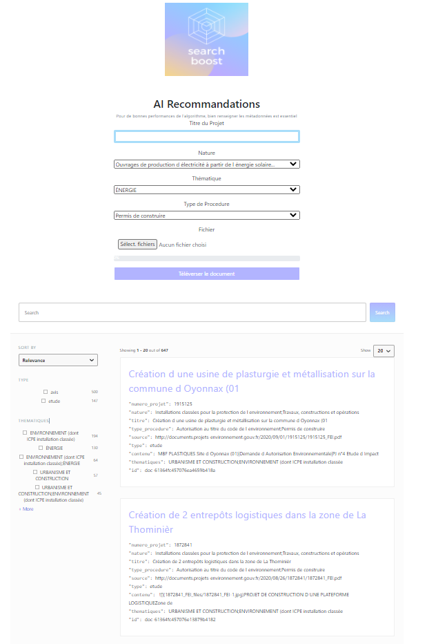
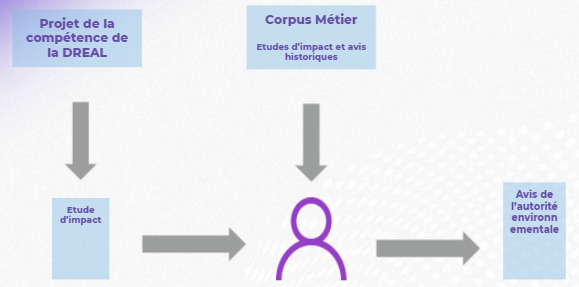
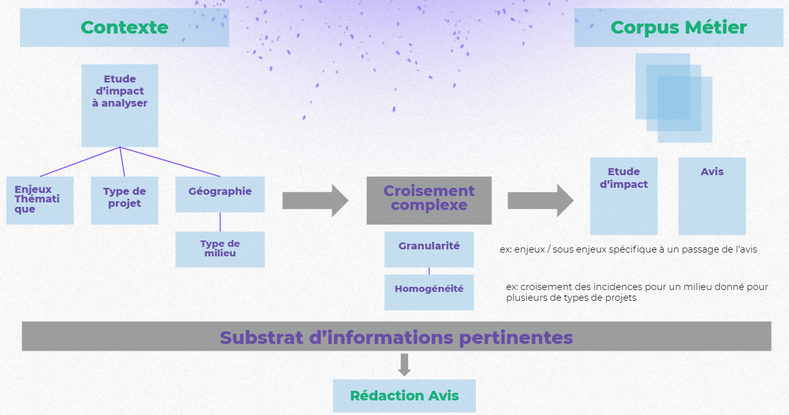
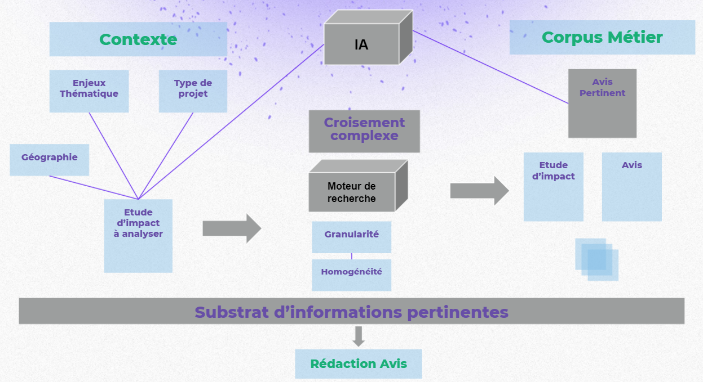
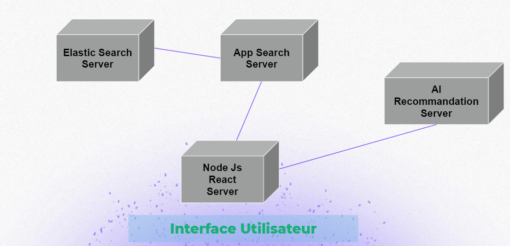

<p align = 'center'>  </p>

<h1 align = 'center'>SearchBoost : un moteur de recherche métier augmenté par l'IA</h1>

<p align = 'center'>  </p>


> :warning: **Le depot contenant le code du projet est trop volumineux (~18GB) pour être hébergé sur GitHub**: Ce que vous voyez dans ce repository n'a que valeur d'illustration, ce n'est pas le depot original sur lequel vous trouverez les sources necessaires à l'éxécution et au developpement du projet.  **Veuillez télécharger le depot complet en suivant ce [lien](https://1drv.ms/u/s!Agn-dI8rdHyBgfE4Ee4AvvYy-sxc9Q?e=8fLAY5)**


SearchBoost est un moteur de recherche *augmenté* par l'IA qui permet aux auditeurs des Direction régionale de l'Environnement, de l'Aménagement et du Logement (DREAL) d'intéragir avec leur corpus de travail composé de plusieurs centaines d'études d'impact et d'avis historiques sur des projets ayant une conséquence sur l'écosysteme. Cette intéraction a été conçue, avec l'étroite collaboration des auditeurs de la DREAL Bretagne, pour être la plus en phase avec le process métier leur permettant ainsi de dégager du temps pour se concentrer sur l'apport de leur expertise dans la redaction des avis.

SearchBoost se structure en deux blocs étroitement liés :
* un moteur de recommandation d'avis propulsé par l'IA qui permet de proposer l'avis historique le plus pertinent étant donné une étude d'impact entrante télévérsée par les auditeurs.

* un moteur de recherche propulsé par la technologie *elasticsearch* permettant des intérogations du corpus métiersen langage naturel,à la manière de *google*, de façon efficiente autant en terme de temps d'éxécution que de pertinence des résultats. Des fonctionnalités avancées comme l'autocomplétion des requêtes sur la barre de recherche ou le filtrage des résultats par thématiques font partie de ce qui est livré avec SearchBoost.


Une note technique sur les tenants et les aboutissants de chacun de ces deux aspects de Search Boost (en terme de choix de conceptions et sur les propriétés mathématiques, statistiques et informatiques du projet) sera bientôt disponible [ici](#note_technique).

<a name="toc"/></a>
## Sommaire  
<!--ts-->
   1. [A propos du projet](#about)  
   2. [Bien commencer](#gettingstarted)    
        * 2.1. [Pré-requis](#requirements)
        * 2.2. [Installation](#installation)     
        * 2.3. [Exécution](#exec)
<!--te-->


<a name="about"/></a>
## 1. A propos du projet
[Back to ToC](#toc)  


<p align = 'center'>  </p>


Le schéma simplifié du process métier des auditeurs des auditeurs de la DREAL Bretagne ci-dessus met en évidence une caractéristique clé de leur métier : lors de l'analyse de l'étude d'impact d'un projet entrant dans le périmètre de compétences de l'autorité environnementale, les auditeurs fondent la rédaction de leur avis sur une travail de recherche documentaire venant appuyer leur expertise. 

SearchBoost se veut comme étant un outil servant à structurer cette intéraction entre auditeur et corpus métier en lui permettant notamment de gérer la densité informationelle à laquelle il est confronté. En effet, les études d'impacts, présentes par centaines, sont des documents pouvant atteindre facilement les 500 pages de contenu spécialisé rendant tout travail de recherche documentaire long et fastidieux. Cette pénibilité est accrue par l'abscence d'infrastructure interne permmetant d'interroger de manière unifiée ce corpus réduisant l'intéraction avec ces documents à être partielle et fragmentée.


<p align = 'center'>  </p>


Dépasser la representation simplificatrice pour définir précisement les modalités de travail des auditeurs avec leur corpus métier était la condition sine qua none à l'établisemment d'une solution technologique au plus proche des besoins. La déconstruction analytique de l'interaction auditeur-corpus indiquée par le schéma ci-dessus permet de mettre en évidence deux grands mouvements :

* Une *analyse macroscopique* qui consiste à définir, à partir d'un étude d'impact entrante, un ensemble de variable de contexte décrivant globalement son contenu (Nature, Enjeux, Type de Projet, Type de Milieu, Géographie etc) et de faire des association potentielle avec des documents existants.
* Une *analyse microscopique* qui consiste à effectuer des croisements *complexes* entre l'étude d'impact et le corpus métier alliant des modulations entre :
    * Granularité : on interroge des récurrences possibles entre le corpus métier et un passage spécifique de l'étude, par exemple sur des enjeux/sous-enjeux environnementaux.
    * Homogénéité :  on cherche par exemple à croiser des incidences environnementales données pour un type de milieu sur plusieurs types de projets


<p align = 'center'>  </p>


L'architecture technique de la solution SearchBoost reprend fidelement la structure de ce process métier en mettant les technologies de l'IA et de moteur de recherche en appui de ces deux grands mouvements: 

* L'*analyse macroscopique* se voit reprise et appuyer par un moteur de recommandation par IA d'avis historique pertinent. Dans son fonctionnement, se basant c'est une representation vectorielle necessairement globale de l'étude d'impact, tout comme sa finalité de recommandation d'un avis pertinent, le moteur de recommandation d'avis par IA est une solution technologique qui s'inscrit de manière cohérente dans le process métier tel que décrit.

* L'*analyse microscopique* se voit quant à elle propulsée par un moteur de recherche conçu sur la technologie *elastic* permettant, précisemment,  des croisements complexes pertinents en termes de correspondance et efficient en termes de temps de calculs.


<p align = 'center'>  </p>

La conception logicielle du projet le décline en quatres serveurs fonctionnant en parallèlle pour délivrer l'experience utilisateur de SearchBoost :

* *Elastic Search Server* a schématiquement pour rôle d'heberger l'index contenant le corpus métier test utilisé ( données de projet environnement océrisées). Ces données sont representées selon une nomenclature NoSQL et de sorte à optimiser pertinence et temps de calculs. (Machine Virtuelle sous CentOS)
* *App Search Server* est une interface entre la barre de recherche des utilisateur et *Elastic Search Server*. Il permet notamment de traduire les requêtes envoyées et reçues de façon optimale tant du point de vue de la performance que de la qualité de la restitution des résultats. (Machine Virtuelle sous CentOS)
* *AI Recommandation Server* a pour role de recevoir les métadonnées ainsi que le pdf des études d'impact à analyser, d'effectuer un ensemble de traitements IA et de renvoyer les recommandations générées à l'interface utilisateur. (Serveur Uvicorn/Starlette en Python)
* *Node JS React Server* constitue l'interface utilisateur de SearchBoost : envoie, receptionne et restitue l'ensemble des élements nécéssaire à l'experience utilisateur. (Serveur Node JS en React)


<a name="gettingstarted"/></a>
## 2. Bien commencer
[Back to ToC](#toc)

Beaucoup d'efforts ont été mis dans la *dockerisation* des différentes composantes logicielle de ce travail. Ainsi, chacun des quatres serveurs décrit précedemment s'exécute à l'interieur de conteneurs dockers fonctionnant les uns avec les autres. 

Ce travail a été effectué en vue de permettre le déploiement et l'exécution simplifiée du projet dans n'importe quel environnement et en seulement quelques lignes de code.


<a name="requirements"/></a>
###  2.1. Pré-requis

Le seul pré-requis est une installation de docker fonctionnel pour le système d'exploitation que vous utilisez pour déployer et éxecuter le projet, que ce soit en local ou sur un provider PaaS par exemple.

Selon votre système d'exploitation, des instruction détaillées sont disponibles dans la [documentation docker](https://docs.docker.com/get-docker/)

Je detaille ci-dessous quelques subtilités à prendre en compte pour l'installation de docker pour les environnements sous Linux et Windows qui ont été les seuls testés en profondeur.
    
#### Linux

Pour pouvoir faire en sorte de faire fonctionner les différents conteneurs docker du projet à l'unisson, le package docker-compose est impératif. Selon la distribution linux que vous utilisez, il se peut qu'il ne soit pas inclus dans le package docker. Si ce n'est pas le cas, veillez à l'installer séparement.


#### Windows

* Le sous-système linux WSL2 est nécessaire pour faire tourner docker sous windows, assurez vous que votre version de windows est compatible.

* Si votre distribution windows permet une backend WSL2, 3 étapes supplémentaires sont nécessaires pour tout bien faire fonctionner :
    1. Activer la fonctionnalité WSL2, [voir les instructions ici](https://docs.microsoft.com/en-us/windows/wsl/install-win10)
    2. Télécharger et installer la mise à jour du noyau linux de WSL2, [voir les instructions ici](https://docs.microsoft.com/windows/wsl/wsl2-kernel)
    3. Créer un fichier nommé *.wslconfig* dans le répertoire *C:\Users\votre_nom_utilisateur* avec pour contenu :

    ```
    [wsl2]
    memory=12GB # Limits VM memory 
    processors=4 # Virtual processors used
    ```  
    Vous pouvez moduler ces valeurs selon votre configuration materielle, cependant un minimum de 6GB de RAM allouée et de 2 processeurs virtuels  est nécessaire pour mon projet.


<a name="installation"/></a>
###  2.1. Installation

> :warning: **Le depot contenant le code du projet est trop volumineux (~18GB) pour être hébergé sur GitHub**: Ce que vous voyez dans ce repository n'a que valeur d'illustration, ce n'est pas le depot original sur lequel vous trouverez les sources necessaires à l'éxécution et au developpement du projet.  **Veuillez télécharger le depot complet en suivant ce [lien](https://1drv.ms/u/s!Agn-dI8rdHyBgfE4Ee4AvvYy-sxc9Q?e=8fLAY5)**


#### Changer les droits autour du répertoire *es_data*

##### Sous Linux / MacOS

Rendez vous à la racine du répertoire du projet dans un terminal et exécutez la commande suivante : 

```
chown -R 1000:1000 es_data/    
``` 

##### Windows

1. Ouvrir une console *powershell* avec les droits administrateur. 
2. Exécutez la commande suivante : 
    ```
    wsl -d docker-desktop    
    ```  
3. Vous êtes desormais connecté au noyau linux associé à docker. Naviguez **par ligne de commande**, toujours au sein de cette console, jusqu'à la racine du projet.
4. Exécutez la commande suivante : 
    ```
    chown -R 1000:1000 es_data/        
    ```  

#### Charger les images docker associées aux quatres serveurs du projet

Rendez vous à la racine du répertoire du projet dans un terminal ou une console *powershell* et exécutez une par une les commandes suivantes : 

```
 docker load --input .\docker_images\searchboost_appsearch.tar
 docker load --input .\docker_images\searchboost_ai_server.tar
 docker load --input .\docker_images\searchboost_react_frontend_t.tar
``` 
*NB : l'image docker d'elasticsearch sera téléchargée, installée et configurée automatiquement lors de l'éxécution du projet*

<a name="exec"/></a>
###  2.2. Exécution

Après toutes ces étapes préparatoires, l'éxécution du projet est désormais très simple.

1. Rendez vous à la racine du répertoire du projet dans un terminal ou une console *powershell* et exécutez la commande :
```
 docker-compose up
``` 
Désormais vous pouvez voir un ensemble de logs détaillant l'amorçage et la configuration de SearchBoost

*NB : Si c'est la première fois que vous lancer le projet au sein de votre environnement, cette commande déclenche le téléchargement, l'installation et la configuration adaptée au projet d'elasticsearch une fois pour toute !*

2. Attendez que les quatres conteneurs correspondant aux différents serveurs du projet s'initialisent à leur rythme et réussisent à communiquer ensemble. Au bout de quelques instants l'instance searchboost_appsearch devrait vous indiquez le message suivant : 

```
 esqueues me while I process jobs on engine_destroyer, mailer, seed_sample_engine
```

3. Ce message signifie que SearchBoost est pret à l'emploi. Ouvrez votre navigateur web  à l'adresse `http://localhost:3000/` pour acceder à l'interface utilisateur ! 


## Auteur

Zakaria BEKKAR
